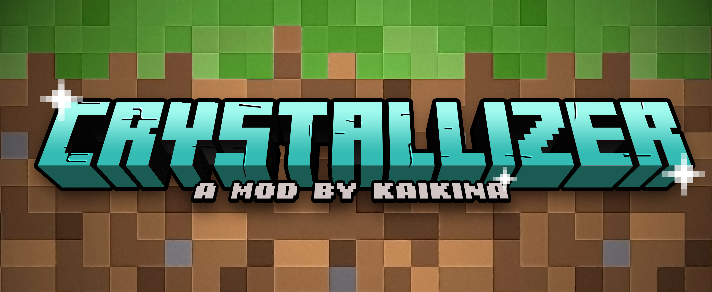

 




# Crystallizer

Crystallizer is a mod that adds to the game a block called "Crystallizer". It's a decorative block that allows the
player to crystallize ores such as : iron, copper, gold, quartz, emerald and diamond. The block needs to be Redstone
powered to start crystallizing. The crystallizing process means that it will generate an infinite amount of the 
crystallizing ore.


## For Users

You can find all our versions on Curseforge:

https://www.curseforge.com/minecraft/mc-mods/crystallizer/files/all

If you want to chat with me :

Kaikina#2165

### Documentation

#### Recipe
The crystallizer can be crafted with : 
```
I H I
I N I
L H L
```
Where :
- I : Iron Block
- H : Hopper
- N : Netherite Block
- L : Lapis Block

#### Crystallizing
To select which ore you want to crystallize, you can open the GUI and insert your ore (Careful, only input 1), or
right-click the block with the ore in your hand. The ore is instantly consumed by the Crystallizer. To start 
crystallizing your ore, the Crystallizer need to be Redstone powered. Once powered it will start crystallizing.

#### Crystallizing times
Every ore as its own crystallizing time, as follows : 
- Iron : 2 min
- Copper : 2 min
- Quartz : 2 min
- Gold : 30 min
- Diamond : 40 min
- Emerald : 40 min

### Creating an Issue

Crystallizer crashes every time? Have a suggestion? Found a bug? Create an issue now!

1. Make sure your issue hasn't already been answered or fixed. Also think about whether your issue is a valid one before
submitting it.
2. Go to the [issues page](https://github.com/Kaikina/crystallizer/issues).
3. Click `New Issue`
4. Choose which type of issue you want to create.
4. Fill in the form. Don't leave anything out!
5. Click `Submit New Issue` and wait for a response!